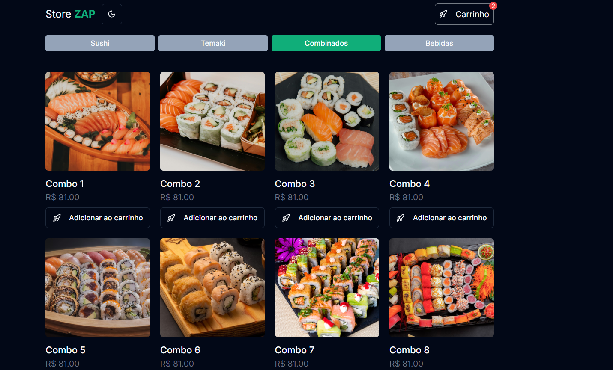

#  Loja Zap

<p align="center">
   

  

  

  <br>
  
  <a href="https://www.codacy.com/manual/Gabriel4420/loja-zap?utm_source=github.com&amp;utm_medium=referral&amp;utm_content=Gabriel4420/loja-zap&amp;utm_campaign=Badge_Grade">
    
  </a>
  
  

  <a href="https://www.linkedin.com/in/gabriel-rodrigues-perez-2069b072/">
    
  </a>
</p>

---

<p align="center">
  
</p>

---

## 📝 Sobre o Projeto

Loja Zap é uma aplicação web moderna que simula uma loja virtual integrada com WhatsApp, permitindo que os clientes façam pedidos diretamente através da plataforma, com envio automático para o WhatsApp do vendedor.

## 🚀 Tecnologias Utilizadas

- React.js
- TypeScript
- Styled Components
- React Router DOM
- Context API
- Local Storage

## ⚙️ Funcionalidades

- Catálogo de produtos
- Carrinho de compras
- Integração com WhatsApp
- Interface responsiva
- Persistência de dados do carrinho

## 📦 Instalação

1. Clone o repositório:

```bash
git clone https://github.com/Gabriel4420/loja-zap.git
```

2. Instale as dependências:

```bash
npm install
```

3. Execute o projeto:

```bash
npm start
```

## 🎯 Implementações Futuras

- [ ] Sistema de autenticação de usuários
- [ ] Painel administrativo para gestão de produtos
- [ ] Integração com sistema de pagamentos
- [ ] Sistema de favoritos
- [ ] Histórico de pedidos
- [ ] Múltiplos temas (claro/escuro)

## 🤝 Como Contribuir

1. Faça um fork do projeto
2. Crie uma branch para sua feature (`git checkout -b feature/AmazingFeature`)
3. Commit suas mudanças (`git commit -m 'Add some AmazingFeature'`)
4. Push para a branch (`git push origin feature/AmazingFeature`)
5. Abra um Pull Request

<h4 align="center">
  Feito com ❤️ por Gabriel Rodrigues 👋️ <a href="mailto:gabriel_rodrigues_perez@hotmail.com">Entre em contato!</a>
</h4>

<p align="center">

  <a href="https://www.linkedin.com/in/gabriel-rodrigues-perez-2069b072/">
    
  </a>
  <a href="https://www.facebook.com/gabriel.rodrigues.perez">
    
  </a>
  <a href="https://www.instagram.com/gabriel_rodrigues_perez/">
    
  </a>
  